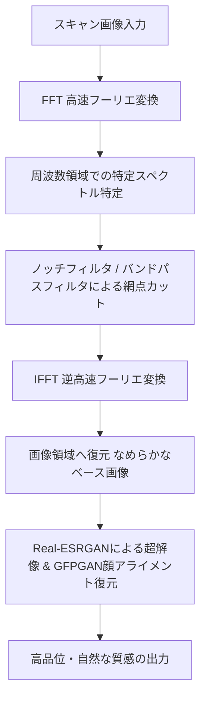

# 写真集スキャン画像の網点・モアレ除去機能（機能拡張案）

本ドキュメントは、印刷物（写真集や雑誌など）のスキャン画像特有の「網点（ハーフトーンスクリーン）ノイズ」および「モアレ（周期的な干渉縞）」を除去し、実写写真のように自然なディテールへ復元するための機能追加の設計案です。

---

## 1. 背景と課題

印刷物を高解像度でスキャンした画像には、印刷プロセス（インクのドット配置）に起因する規則正しい網点パターンが格子状に写り込みます。
この画像を通常の超解像AI（Real-ESRGAN）や一般的なノイズ除去フィルタ（Bilateral Filter 等）に入力すると、以下の問題が発生します。

* **イラスト調（絵画風）への劣化**: 網点を消そうと強い平滑化を行うと、肌のテクスチャや衣服の質感が失われ、のっぺりとした絵の具で塗ったような質感になります。
* **網点ノイズの強調**: 通常のシャープネス処理を施すと、格子状のドットパターンが逆に際立ち、ざらつきやチリチリしたノイズが大幅に増加します。

したがって、通常のデジカメ写真用のノイズ除去とは異なる、**「周期的な網点パターンそのものを特定して低減・除去する前処理技術」**が必要となります。

---

## 2. 提案する解決手法（コアロジック）

スキャン画像特有の周期性ノイズに対しては、二次元の周波数解析が極めて有効です。



### ① FFT（高速フーリエ変換）による周波数フィルタリング
網点は画像全体に「一定の一定間隔・角度」で並んでいるため、画像を空間周波数領域（FFT）に変換すると、特定の周波数座標に強いエネルギーを持った「輝点（特異点）」として明確に現れます。
* FFTを用いて網点の周波数成分を特定し、その特異点のみをカットする**「ノッチフィルタ」**または**「バンドパスフィルタ」**を適用します。
* 逆フーリエ変換（IFFT）で画像領域に戻すことで、髪の毛や輪郭などのディテールを一切ぼかすことなく、格子状のノイズだけを自動で消去します。

### ② 適応的プレ・デノイズ（ぼかし ＆ ディテール補正）
印刷ドットが荒い場合や、微細なモアレに対しては、FFT後にごくわずかなローパスフィルタ（バイラテラルまたはガイド付きフィルタ）をかけ、Real-ESRGANに入力します。これにより、AIがドットを「ノイズ」ではなく「なめらかなグラデーション」として解釈し、美しい肌の質感を再生成できるようになります。

---

## 3. UI/UX 設計案（タブによる拡張）

現在の CustomTkinter のコントロールパネル（左ペイン）を `CTkTabview` を用いてタブ化し、ユーザーがソース画像の種類に応じてワンクリックで処理パイプラインを切り替えられるようにします。

```
+---------------------------------------------------+
|  [コントロールパネル]                              |
|  +---------------------------------------------+  |
|  |   通常写真モード   |   印刷スキャンモード   |  |
|  +---------------------------------------------+  |
|  |                                             |  |
|  |  ・網点ノイズ除去強度 [ ---|--- ] 50%       |  |
|  |  ・モアレ低減（FFT）   [v] 有効             |  |
|  |                                             |  |
|  |  ・AIモデル選択       [ Standard (高画質) ] |  |
|  |  ・倍率               [ 等倍 ][  2x  ]      |  |
|  |  ・デノイズ強度       [ ---|--- ] 5%        |  |
|  |  ・シャープネス強度   [ ---|--- ] 20%       |  |
|  |  ・人物の顔・瞳修復   [v] 有効             |  |
|  |                                             |  |
|  +---------------------------------------------+  |
+---------------------------------------------------+
```

### パラメータの追加
* **「網点ノイズ除去強度」スライダー (0 - 100%)**: 
  印刷の線数（きめの細かさ・ドットの大きさ）に応じて、FFTでカットする周波数帯の幅やマスクの強さを調整可能にします。

---

## 4. 今後の展望・期待される効果

* **スキャン写真アーカイブの画質劇的向上**:
  古い写真集や雑誌のスキャンデータを、まるでデジタルカメラで撮り下ろしたかのようなクリアで滑らかな質感へ蘇らせることが可能になります。
* **差別化機能**:
  多くの一般的なAIアップスケーラーが苦手とする「スキャン画像のモアレ・網点」に特化した前処理を組み合わせることで、実用性の高いプレミアムなツールとしての価値がさらに高まります。
